Most of what I build starts as a hackathon problem statement: a Smart India Hackathon (SIH) brief from the Ministry of Defence, a state government or a university hackathon. I keep working on it until it is a real, working system. I care about tools that show their reasoning, whether that is a VPN scanner explaining its grade, a credit score explaining its features, or an algorithm you can watch run.

The header above is a real hash chain: each block's SHA-256 covers the block before it. A GitHub Action rebuilds it every night, and new projects with a live demo join the chain automatically.

 

### On screen

Recorded from the live deployments, not mockups.

 

### Now building

**[TunnelScope](https://github.com/Chandankumar775/tunnlescope)** &nbsp;·&nbsp; [live ↗](https://tunnlescope.vercel.app) 
AI-driven IPsec VPN analysis for Smart India Hackathon. It reads encrypted tunnel traffic and reports what was negotiated, how secure it is, and what a passive observer can still learn. Eleven deployments are graded A to F, and a fix simulator regrades a tunnel live as you apply each recommendation.

**[AURA-CV](https://github.com/Chandankumar775/aura-cv)** &nbsp;·&nbsp; [live ↗](https://aura-cv-phi.vercel.app) 
Air-gapped integrity assurance for computer-vision pipelines, built for the Ministry of Defence problem statement at SIH. It checks datasets, models and inference outputs from untrusted contributors, and records every finding in a hash-chained audit log signed with Ed25519.

 

### Field notes

 

### Selected work

| | What it does | Built with |
| :-- | :-- | :-- |
| **[Arbitrage System, in 3D](https://github.com/Chandankumar775/model-analysis-for-the-arbitage-system-)**  [live ↗](https://model-analysis-for-the-arbitage-sys.vercel.app) | An interactive model of a forex arbitrage detector. You can watch Bellman-Ford relax every edge and trace a negative cycle across a live currency graph. | Three.js, WebGL |
| **[EMF Multi-Agent](https://github.com/Chandankumar775/emf-multiagent)** | One request coordinates several paid AI endpoints. Each step of an agent pipeline is settled as its own USDC micro-payment on Algorand. | TypeScript, Algorand |
| **[CredTech](https://github.com/Chandankumar775/credtech-by-chandan-kumar-)** | Explainable credit scoring: it combines financial and unstructured data into real-time scores, with the reasons behind each one shown feature by feature. | Next.js, ML |
| **[Nagrik Setu](https://github.com/Chandankumar775/nagrik-setu)** | Civic issue reporting for the Government of Jharkhand, built with Team Urban Dons for SIH. | Next.js, TypeScript |
| **[Neighbour Energy Exchange](https://github.com/Chandankumar775/free_transaction_to-my-neighbour-)** | Peer-to-peer solar and wind energy trading between neighbours, with no utility in the middle. Built for the KR Manglam University Hackathon 2026. | Solidity, TypeScript |
| **[CharityChain](https://github.com/Chandankumar775/CharityChain)** | Transparent charity donations: smart contracts, NGO verification and on-chain tracking of where every donation goes. | Solidity, Flutter, Next.js |
| **[Eco-Ward Dashboard](https://github.com/Chandankumar775/new-delhi-dashboard-eco-ward-)**  [live ↗](https://new-delhi-dashboard-eco-ward.vercel.app) | Ward-level air quality intelligence for New Delhi. | Next.js |

Also: a [URL scanner](https://github.com/Chandankumar775/url-scanner-), a [CVE explainer](https://github.com/Chandankumar775/-cve-explainer-ml) built on machine learning, [Watchtower Sentinel](https://github.com/Chandankumar775/watchtower-sentinel), and my [machine learning lab notebooks](https://github.com/Chandankumar775/MACHINE-LEARNING-ALL-FILES-BY-CHANDAN-KUMAR-).

 

### Live traffic

 

### Tools I reach for

**Languages** &nbsp; TypeScript · Python · JavaScript · Solidity · Java · Dart 
**Building** &nbsp; Next.js · React · Three.js · Flutter · Spring Boot 
**Security & ML** &nbsp; IPsec / strongSwan · Ed25519 & SHA-256 · Python ML · Jupyter 
**Shipping** &nbsp; Vercel · Firebase · PostgreSQL · Docker · Git

 

Delhi, India · Open to hackathon teams and security or AI collaborations: open an issue on any repo to reach me.
