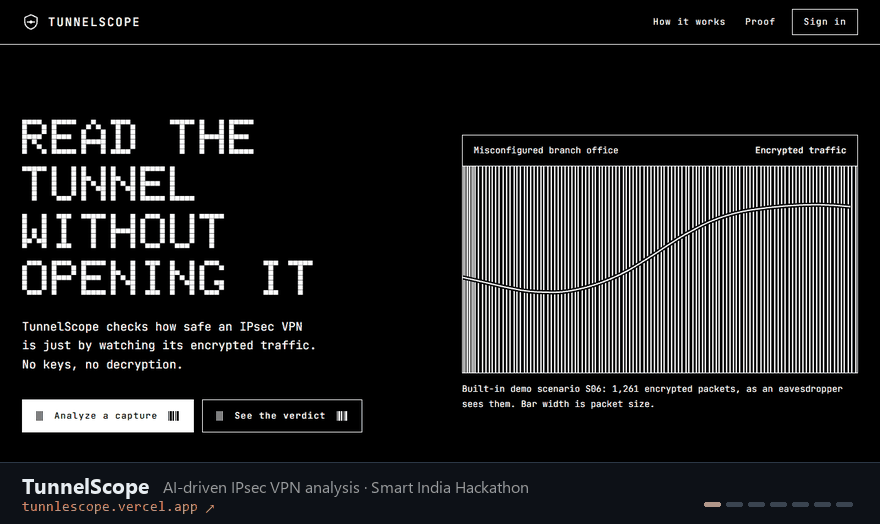

I'm a security and AI engineer. Most of my projects come down to one question: *can this input be trusted, and can the system show why?* That covers encrypted VPN traffic, computer-vision models, credit decisions and donations. Below, each project is sketched the way I'd explain it at a whiteboard. Click a sheet to open it, or expand **How it's built** for the details.

 

<b>How it's built</b> · AURA-CV

 

- Evaluates a contributed dataset, a trained model, inference records and new input batches without trusting any source.
- Check plugins produce findings and a disposition. Each one is written to a **hash-chained audit log, signed with Ed25519** over **RFC 8785** canonical JSON.
- An outbound network guard keeps it truly air-gapped, and `aura selfcheck` verifies the install.
- **Python** (Pydantic, cryptography, rfc8785, Typer) for the engine; **React + Three.js** for the assurance console.

[Live demo ↗](https://aura-cv-phi.vercel.app) · [Repository](https://github.com/Chandankumar775/aura-cv)

 

<b>How it's built</b> · TunnelScope

 

- Dissects an encrypted IPsec capture: identifies the protocol (with method and confidence), assesses its security, builds a threat matrix and reports metadata exposure.
- Grades 11 demo deployments from **A to F**. The fix simulator recomputes the score live and produces the **strongSwan** config diff.
- Fleet map, compliance checks, executive and technical reports, and offline Q&A, all running in the browser with no backend.
- **TypeScript + React**, Zustand for state, Recharts, Framer Motion, Firebase.

[Live demo ↗](https://tunnlescope.vercel.app) · [Repository](https://github.com/Chandankumar775/tunnlescope)

 

<b>How it's built</b> · Arbitrage System, in 3D

 

- Converts exchange rates into a graph with weights `w = −log(rate × (1 − fee))`, so a profitable loop becomes a **negative cycle**.
- Runs Bellman-Ford in the browser and records every relaxation, which is replayed step by step in a 17-step 3D walkthrough of a Spring Boot + Java Swing architecture.
- Live mode re-detects arbitrage on random-walk prices every tick. Hover tracing links the data tables to the 3D model.
- **Three.js / WebGL** with procedural canvas textures and no image assets.

[Live demo ↗](https://model-analysis-for-the-arbitage-sys.vercel.app) · [Repository](https://github.com/Chandankumar775/model-analysis-for-the-arbitage-system-)

 

<b>How it's built</b> · CredTech

 

- Ingests multi-source financial data alongside unstructured text and produces real-time credit scores.
- Each score comes with **feature-level explanations** showing what pushed it up or down, in an analyst dashboard.
- **Next.js + TypeScript**, **Genkit with Gemini** for the unstructured side, Firebase, Radix UI.

[Repository](https://github.com/Chandankumar775/credtech-by-chandan-kumar-)

 

<b>How it's built</b> · EMF Multi-Agent

 

- A research-agent pipeline (search, scrape, summarise, write the report) where each step is an independently priced API call.
- Each step settles its own USDC micro-payment, x402-style, on Algorand testnet. The demo shows **Pending → Paying → Settled** with simulated transaction hashes.
- **Next.js + React + TypeScript**, Recharts, Framer Motion.

[Repository](https://github.com/Chandankumar775/emf-multiagent)

 

<b>How it's built</b> · CharityChain

 

- Donations flow through a **Solidity** smart contract, with NGO verification and admin controls over who can receive funds.
- Every transaction is traceable on-chain, and MetaMask is used for wallets.
- Two clients: a **Next.js** web app (ethers.js, React Query) and a **Flutter** app (web3dart).

[Repository](https://github.com/Chandankumar775/CharityChain)

 

### The same projects, running

Also on my GitHub: [Nagrik Setu](https://github.com/Chandankumar775/nagrik-setu) (civic reporting) · [Eco-Ward](https://new-delhi-dashboard-eco-ward.vercel.app) (Delhi air quality) · [URL scanner](https://github.com/Chandankumar775/url-scanner-) · [CVE explainer](https://github.com/Chandankumar775/-cve-explainer-ml) · [Neighbour Energy Exchange](https://github.com/Chandankumar775/free_transaction_to-my-neighbour-)

Delhi, India
